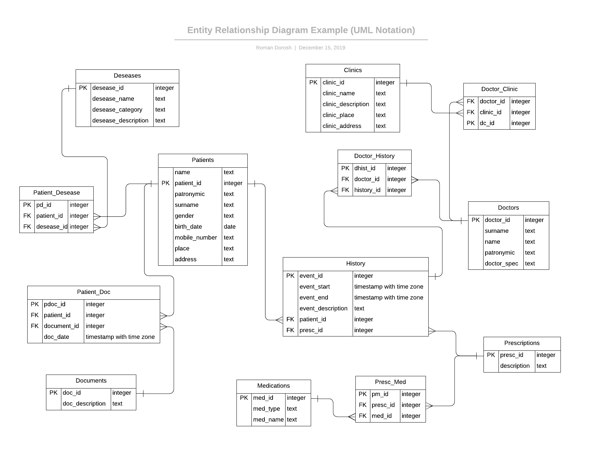

# MedicDB
This repo contains ER-diagram with some SQL queries to get data from medical card database.
## Entity Relatioship(ER) diagram

## Tools
* Windows 10 version 1809
* PgAdmin 4 
* For creating ER-diagram https://www.lucidchart.com/
## Example of SQL queries
1. Select all doctors from database
```sql
select * from "Doctors";
```
| doctor_id |  surname  |   name   | patronymic |  doctor_spec    |
|-----------|-----------|----------|------------|----------------|
|         0 | Gleeton   | Reynard  | McCarry    | Therapist       |
|         1 | Patillo   | Dotty    | Laughtisse | Allergist       |
|         2 | Cragell   | Dav      | Talby      | Oncologist      |
|         3 | Routledge | Virginie | Kirkness   | Cardiologist    |
|         4 | Sire      | Kitty    | MacMychem  | Rheumatologist  |
2. Select clinic, name and surname of all doctors with name "Reynard"
```sql
select c.clinic_name, d.name, d.surname
from "Clinics" as c, "Doctors" as d "Doctor_Clinic" as dc 
where d.name = 'Reynard'
and dc.doctor_id = d.doctor_id
and dc.clinic_id = c.clinic_id;
```
|  clinic_name   |  name    | surname |
|----------------|----------|---------|
| Med-Atlant     | Reynard  | Gleeton |
| Oxford-Medical | Reynard  | Gleeton |
3. Count how much events where doctor prescribes "Atenolo" to the patients.
```sql
select count(h.event_id), event_description from "History" as h 
inner join "Prescriptions" as p on h.presc_id = p.presc_id 
where description like '%Atenolo%';
```
| count | event_description |
|-------|-------------------|
|     1 | High pressure case|
4. Select all events between 2019 year
```sql
select event_id, event_description from "History"
where "event_end" between '2019-01-01' and '2019-12-31';
```
| event_id | event_description  |
|----------|--------------------|
|        0 | Flu case           |
|        1 | Flu case           |
|        2 | Cancer case        |
|        3 | Cancer case        |
|        4 | High pressure case |
|        5 | Lyme allergie case |
5. Select all patients who have chronic or allergies deseases
```sql
select p.surname, p.name, d.desease_category from "Patients" as p 
inner join "Patient_Desease" as pd on p.patient_id = pd.patient_id 
inner join "Deseases" as d on pd.desease_id = d.desease_id 
where d.desease_category like '%Chronic%' 
or d.desease_category like '%Allergie%';
``` 
| surname  | name  | desease_category |
|----------|-------|------------------|
| Lautie   | Daron | Allergies        |
| Gradly   | Corey | Chronic          |

